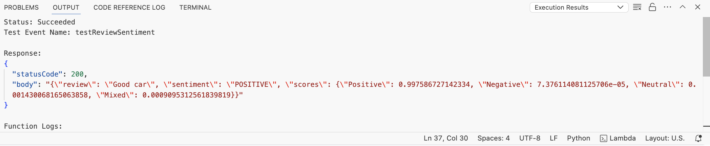
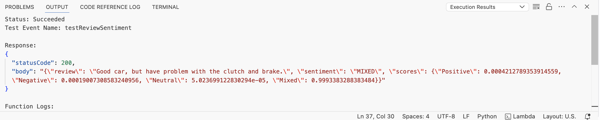
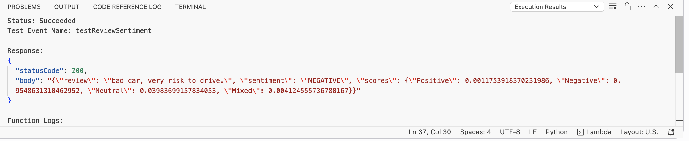

# 📊 Sentiment Analysis API using AWS Lambda & Amazon Comprehend

This project provides a serverless REST API to analyze the **sentiment of user reviews** using **Amazon Comprehend**, deployed on **AWS Lambda** and exposed via **API Gateway**.

---

## 🚀 Features

- Analyze the **sentiment** of a given text (`POSITIVE`, `NEGATIVE`, `NEUTRAL`, `MIXED`)
- Returns sentiment confidence **scores as percentages**
- Fully serverless and scalable with AWS Lambda
- Testable via **Postman** or any REST client

---

## 🛠️ Tech Stack

- **AWS Lambda**
- **Amazon API Gateway**
- **Amazon Comprehend**
- **Boto3 (Python SDK)**
- **Python 3.x**

---

## Setup 

### 🔐 IAM & Permissions

The Lambda function must have the following IAM permissions:

- comprehend:DetectSentiment
- logs:CreateLogGroup
- logs:CreateLogStream
- logs:PutLogEvents

Attach the AWS-managed policy:
- AmazonComprehendFullAccess
- CloudWatchLogsFullAccess (for logging)


## 📥 API Usage

### 📌 Endpoint

`POST https://<your-api-id>.execute-api.<region>.amazonaws.com/prod/sentiment`

Content-Type: application/json

```
{
  "review": "The product is absolutely amazing! I loved the quality and delivery time."
}
```

### ✅ Response Body

```
{
  "review": "The product is absolutely amazing! I loved the quality and delivery time.",
  "sentiment": "POSITIVE",
  "scores": {
    "Positive": "99.8 %",
    "Negative": "0.0 %",
    "Neutral": "0.1 %",
    "Mixed": "0.1 %"
  }
}
```


## Output

The below is the screenshot of the JSON response for the POSITIVE, MIXED and NEGATIVE Reviews

### Positive review




### Mixed Review



### Negative Review

